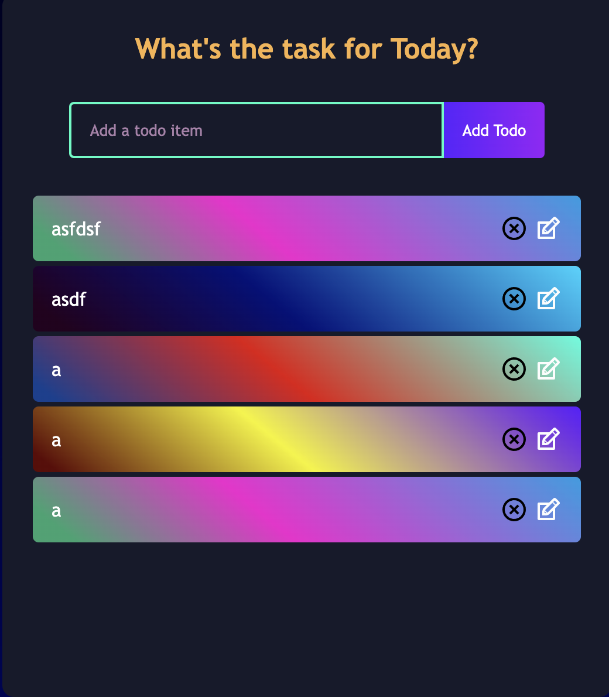

## 1. React TodoList 온보딩

### 1.1 TodoList ADD 기능 만들어보기
* 구현 범위
    * 인풋창에 입력값을 입력한 후, add 버튼을 누르면, 입력값이 추가되어야 합니다.
    * 빈 문자열은 추가되지 못하게 합니다.
    * add 1번 클릭당 1개의 데이터가 추가되어야 합니다.
    * 클릭 후, 입력창이 초기화 되어야 합니다.
    * 데이터는 중복되어서 추가되어도 됩니다.
    
### 1.2 TodoList DELETE 기능 만들어보기
* 구현 범위
    * 삭제 버튼 클릭 시, todoItem이 제거되어야 합니다.

### 1.3 TodoList COMPLETE 기능 만들어보기
* 구현 범위
    * 완료 버튼 클릭 시, todoItem이 밑줄이 그어져야 합니다.

### 1.4 TodoList EDIT 기능 만들어보기
* 구현 범위
    * 수정 버튼 클릭 시, 인풋창으로 변경 되어야 합니다.
    * 인풋창 상태에서 텍스트를 입력 후, 수정완료 버튼을 누르면 변경된 텍스트가 TodoItem에 적용되어야 합니다.
